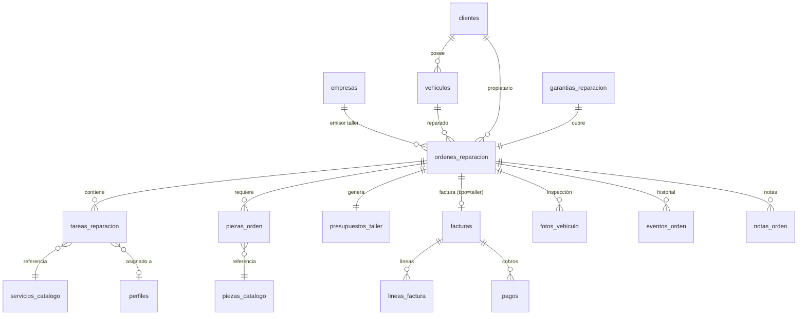

# 02 — Base de Datos y Esquema

> Las decisiones arquitectónicas (DA-01 a DA-06) del [doc 08](./08-DECISIONES-ARQUITECTURA.md) están **APROBADAS**.  
> Este documento refleja las decisiones finales: tabla `vehiculos` centralizada, tabla `facturas` reutilizada (sin `facturas_taller` separada).

## 2.1 Diagrama de Relaciones (ERD)



---

## 2.2 Tablas Nuevas

### `vehiculos` — Registro centralizado de vehículos (DA-02 ✅)

Cada vehículo existe UNA sola vez. Las órdenes lo referencian.

```sql
CREATE TABLE vehiculos (
    id                  UUID PRIMARY KEY DEFAULT gen_random_uuid(),
    empresa_id          UUID NOT NULL REFERENCES empresas(id) ON DELETE CASCADE,
    cliente_id          UUID NOT NULL REFERENCES clientes(id) ON DELETE CASCADE,

    matricula           TEXT NOT NULL,
    marca               TEXT NOT NULL,
    modelo              TEXT NOT NULL,
    anio                INTEGER,
    color               TEXT,
    bastidor            TEXT,                    -- VIN
    combustible         TEXT CHECK (combustible IN ('gasolina', 'diesel', 'electrico', 'hibrido', 'glp', 'otro')),
    km_actual           INTEGER,                 -- Se actualiza con cada orden

    fecha_matriculacion DATE,
    potencia_cv         INTEGER,
    tipo_vehiculo       TEXT DEFAULT 'turismo' 
        CHECK (tipo_vehiculo IN ('turismo', 'furgoneta', 'motocicleta', 'camion', 'otro')),

    notas               TEXT,
    activo              BOOLEAN NOT NULL DEFAULT true,

    created_at          TIMESTAMPTZ NOT NULL DEFAULT now(),
    updated_at          TIMESTAMPTZ NOT NULL DEFAULT now(),

    UNIQUE(empresa_id, matricula)
);

CREATE INDEX idx_vehiculos_empresa ON vehiculos(empresa_id);
CREATE INDEX idx_vehiculos_cliente ON vehiculos(cliente_id);
CREATE INDEX idx_vehiculos_matricula ON vehiculos(matricula);
```

---

### `servicios_catalogo` — Catálogo de Servicios del Taller

Servicios predefinidos que el taller ofrece (ej: "Cambio de aceite", "Revisión ITV", "Cambio de pastillas de freno").

```sql
CREATE TABLE servicios_catalogo (
    id              UUID PRIMARY KEY DEFAULT gen_random_uuid(),
    empresa_id      UUID NOT NULL REFERENCES empresas(id) ON DELETE CASCADE,
    nombre          TEXT NOT NULL,                          -- "Cambio de aceite y filtro"
    descripcion     TEXT,                                   -- Descripción detallada
    categoria       TEXT NOT NULL DEFAULT 'general',        -- mecanica, electricidad, chapa_pintura, neumaticos, revision, otro
    precio_mano_obra NUMERIC(10,2),                        -- Precio base de mano de obra (€)
    horas_estimadas NUMERIC(5,2),                          -- Horas estimadas para el servicio
    iva_porcentaje  NUMERIC(5,2) NOT NULL DEFAULT 21.00,   -- IVA aplicable (21% estándar)
    activo          BOOLEAN NOT NULL DEFAULT true,
    orden           INTEGER NOT NULL DEFAULT 0,            -- Para ordenar en la UI
    created_at      TIMESTAMPTZ NOT NULL DEFAULT now(),
    updated_at      TIMESTAMPTZ NOT NULL DEFAULT now()
);
```

---

### `piezas_catalogo` — Catálogo de Piezas y Recambios

Inventario de piezas/recambios disponibles en el taller.

```sql
CREATE TABLE piezas_catalogo (
    id              UUID PRIMARY KEY DEFAULT gen_random_uuid(),
    empresa_id      UUID NOT NULL REFERENCES empresas(id) ON DELETE CASCADE,
    referencia      TEXT NOT NULL,                          -- Código de referencia del fabricante
    nombre          TEXT NOT NULL,                          -- "Filtro de aceite MANN W 712/95"
    descripcion     TEXT,
    categoria       TEXT NOT NULL DEFAULT 'general',        -- filtros, frenos, aceites, neumaticos, electricidad, carroceria, otro
    marca           TEXT,                                   -- Marca del fabricante de la pieza
    precio_coste    NUMERIC(10,2),                          -- Precio de coste (compra al proveedor)
    precio_venta    NUMERIC(10,2) NOT NULL,                 -- Precio de venta al público (PVP)
    iva_porcentaje  NUMERIC(5,2) NOT NULL DEFAULT 21.00,
    stock_actual    INTEGER NOT NULL DEFAULT 0,
    stock_minimo    INTEGER NOT NULL DEFAULT 0,             -- Alerta cuando stock < mínimo
    unidad          TEXT NOT NULL DEFAULT 'ud',             -- ud, litro, metro, kg
    activo          BOOLEAN NOT NULL DEFAULT true,
    created_at      TIMESTAMPTZ NOT NULL DEFAULT now(),
    updated_at      TIMESTAMPTZ NOT NULL DEFAULT now()
);
```

---

### `ordenes_reparacion` — Orden de Reparación (Documento Central)

El documento maestro que controla todo el flujo de trabajo de una reparación. Referencia a `vehiculos` en lugar de duplicar datos del coche.

```sql
CREATE TABLE ordenes_reparacion (
    id                  UUID PRIMARY KEY DEFAULT gen_random_uuid(),
    empresa_id          UUID NOT NULL REFERENCES empresas(id) ON DELETE CASCADE,
    cliente_id          UUID NOT NULL REFERENCES clientes(id) ON DELETE RESTRICT,
    vehiculo_id         UUID NOT NULL REFERENCES vehiculos(id),  -- Referencia al vehículo (DA-02)
    user_id             UUID NOT NULL REFERENCES auth.users(id),  -- Quién creó la orden

    -- Número de orden (correlativo automático — DA-04)
    numero_orden        TEXT NOT NULL UNIQUE,                     -- "OR-2026-0001"

    -- Snapshot de km al entrar/salir (se guarda aparte del vehículo)
    vehiculo_km_entrada INTEGER,                                 -- Km al recibir
    vehiculo_km_salida  INTEGER,                                 -- Km al entregar

    -- Estado y flujo
    estado              TEXT NOT NULL DEFAULT 'recepcion'
        CHECK (estado IN (
            'recepcion', 'presupuesto_pendiente', 'presupuesto_enviado',
            'presupuesto_aceptado', 'presupuesto_rechazado',
            'en_reparacion', 'pendiente_piezas', 'revision_calidad',
            'completado', 'entregado', 'cancelado'
        )),

    -- Fechas clave
    fecha_recepcion     TIMESTAMPTZ NOT NULL DEFAULT now(),
    fecha_presupuesto   TIMESTAMPTZ,
    fecha_aprobacion    TIMESTAMPTZ,
    fecha_inicio_trabajo TIMESTAMPTZ,
    fecha_fin_trabajo   TIMESTAMPTZ,
    fecha_entrega_estimada TIMESTAMPTZ,
    fecha_entrega_real  TIMESTAMPTZ,
    fecha_notificacion_listo TIMESTAMPTZ,

    -- Descripción
    motivo_entrada      TEXT NOT NULL,                           -- "Ruido al frenar"
    observaciones_recepcion TEXT,
    diagnostico         TEXT,
    observaciones_entrega TEXT,
    motivo_cancelacion  TEXT,                                    -- Si se cancela, por qué

    -- Importes calculados (se actualizan dinámicamente con optimistic updates)
    total_mano_obra     NUMERIC(10,2) NOT NULL DEFAULT 0,
    total_piezas        NUMERIC(10,2) NOT NULL DEFAULT 0,
    total_base_imponible NUMERIC(10,2) NOT NULL DEFAULT 0,
    total_iva           NUMERIC(10,2) NOT NULL DEFAULT 0,
    total_factura       NUMERIC(10,2) NOT NULL DEFAULT 0,

    -- Prioridad y ordenación (DA-06: editabilidad)
    prioridad           TEXT NOT NULL DEFAULT 'normal'
        CHECK (prioridad IN ('urgente', 'alta', 'normal', 'baja')),
    orden_prioridad     INTEGER NOT NULL DEFAULT 0,              -- Para reordenar dentro de la misma prioridad (drag & drop)

    -- Garantía
    en_garantia         BOOLEAN NOT NULL DEFAULT false,
    orden_garantia_ref  UUID REFERENCES ordenes_reparacion(id),

    created_at          TIMESTAMPTZ NOT NULL DEFAULT now(),
    updated_at          TIMESTAMPTZ NOT NULL DEFAULT now()
);

-- Índices para búsquedas frecuentes
CREATE INDEX idx_ordenes_rep_empresa ON ordenes_reparacion(empresa_id);
CREATE INDEX idx_ordenes_rep_cliente ON ordenes_reparacion(cliente_id);
CREATE INDEX idx_ordenes_rep_vehiculo ON ordenes_reparacion(vehiculo_id);
CREATE INDEX idx_ordenes_rep_estado ON ordenes_reparacion(estado);
CREATE INDEX idx_ordenes_rep_fecha ON ordenes_reparacion(fecha_recepcion DESC);

-- Índice compound para la query más frecuente: órdenes activas ordenadas
CREATE INDEX idx_ordenes_activas ON ordenes_reparacion(empresa_id, estado, prioridad, orden_prioridad)
    WHERE estado NOT IN ('entregado', 'cancelado');
```

---

### `tareas_reparacion` — Tareas/Trabajos dentro de una Orden

Cada trabajo individual que se debe realizar. El mecánico marca estas tareas como completadas.

```sql
CREATE TABLE tareas_reparacion (
    id                  UUID PRIMARY KEY DEFAULT gen_random_uuid(),
    orden_id            UUID NOT NULL REFERENCES ordenes_reparacion(id) ON DELETE CASCADE,
    servicio_catalogo_id UUID REFERENCES servicios_catalogo(id),   -- Referencia al catálogo (opcional si es personalizada)

    descripcion         TEXT NOT NULL,                              -- "Sustituir pastillas de freno delanteras"
    categoria           TEXT NOT NULL DEFAULT 'general',

    -- Asignación
    mecanico_id         UUID REFERENCES auth.users(id),            -- Mecánico asignado
    mecanico_nombre     TEXT,                                      -- Nombre (cache para la hoja de trabajo)

    -- Estado check
    estado              TEXT NOT NULL DEFAULT 'pendiente',          -- pendiente | en_progreso | completada | bloqueada
    completada          BOOLEAN NOT NULL DEFAULT false,
    fecha_inicio        TIMESTAMPTZ,
    fecha_fin           TIMESTAMPTZ,

    -- Costes
    horas_estimadas     NUMERIC(5,2),
    horas_reales        NUMERIC(5,2),
    precio_hora         NUMERIC(10,2) NOT NULL DEFAULT 0,          -- €/hora aplicada
    total_mano_obra     NUMERIC(10,2) NOT NULL DEFAULT 0,          -- horas_reales × precio_hora

    -- Ordenación
    orden               INTEGER NOT NULL DEFAULT 0,

    -- Notas del mecánico
    notas_mecanico      TEXT,                                       -- "Se detectó desgaste irregular, posible problema de alineación"
    es_averia_adicional BOOLEAN NOT NULL DEFAULT false,             -- ¿Detectada durante la reparación?

    created_at          TIMESTAMPTZ NOT NULL DEFAULT now(),
    updated_at          TIMESTAMPTZ NOT NULL DEFAULT now()
);

CREATE INDEX idx_tareas_orden ON tareas_reparacion(orden_id);
CREATE INDEX idx_tareas_mecanico ON tareas_reparacion(mecanico_id);
```

---

### `piezas_orden` — Piezas/Recambios usados en una Orden

```sql
CREATE TABLE piezas_orden (
    id                  UUID PRIMARY KEY DEFAULT gen_random_uuid(),
    orden_id            UUID NOT NULL REFERENCES ordenes_reparacion(id) ON DELETE CASCADE,
    pieza_catalogo_id   UUID REFERENCES piezas_catalogo(id),

    -- Datos de la pieza (copiados del catálogo o manuales)
    referencia          TEXT,
    nombre              TEXT NOT NULL,
    marca               TEXT,

    -- Cantidades y precios
    cantidad            NUMERIC(10,2) NOT NULL DEFAULT 1,
    unidad              TEXT NOT NULL DEFAULT 'ud',
    precio_unitario     NUMERIC(10,2) NOT NULL,                     -- PVP unitario
    descuento_porcentaje NUMERIC(5,2) NOT NULL DEFAULT 0,
    total               NUMERIC(10,2) NOT NULL,                     -- cantidad × precio × (1 - desc%)
    iva_porcentaje      NUMERIC(5,2) NOT NULL DEFAULT 21.00,

    -- Tipo de pieza
    tipo_pieza          TEXT NOT NULL DEFAULT 'nueva',               -- nueva | reconstruida | usada
    -- Si es usada/reconstruida, requiere consentimiento por escrito del cliente (RD 1457/1986)
    consentimiento_cliente BOOLEAN NOT NULL DEFAULT false,

    -- Devolución de pieza vieja al cliente
    pieza_vieja_devuelta BOOLEAN NOT NULL DEFAULT false,            -- RD 1457/1986: obligación de devolver

    created_at          TIMESTAMPTZ NOT NULL DEFAULT now()
);

CREATE INDEX idx_piezas_orden ON piezas_orden(orden_id);
```

---

### `presupuestos_taller` — Presupuesto Previo (Legal)

Documento que se genera antes de iniciar la reparación. Obligatorio por Real Decreto 1457/1986.

```sql
CREATE TABLE presupuestos_taller (
    id                  UUID PRIMARY KEY DEFAULT gen_random_uuid(),
    orden_id            UUID NOT NULL UNIQUE REFERENCES ordenes_reparacion(id) ON DELETE CASCADE,

    numero_presupuesto  TEXT NOT NULL UNIQUE,                        -- "PT-2026-0001"

    -- Importes del presupuesto
    total_mano_obra     NUMERIC(10,2) NOT NULL DEFAULT 0,
    total_piezas        NUMERIC(10,2) NOT NULL DEFAULT 0,
    base_imponible      NUMERIC(10,2) NOT NULL DEFAULT 0,
    iva                 NUMERIC(10,2) NOT NULL DEFAULT 0,
    total               NUMERIC(10,2) NOT NULL DEFAULT 0,

    -- Estado legal
    estado              TEXT NOT NULL DEFAULT 'borrador',            -- borrador | enviado | aceptado | rechazado | caducado
    fecha_emision       TIMESTAMPTZ,
    fecha_respuesta     TIMESTAMPTZ,                                -- Cuándo respondió el cliente
    fecha_caducidad     TIMESTAMPTZ,                                -- 12 días hábiles desde emisión (RD 1457/1986)
    dias_validez        INTEGER NOT NULL DEFAULT 12,

    -- Firma
    aceptado_por        TEXT,                                       -- Nombre de quien aceptó
    firma_cliente       TEXT,                                       -- Firma digital (base64 o URL)
    renuncia_presupuesto BOOLEAN NOT NULL DEFAULT false,            -- Si el cliente renunció expresamente

    -- Observaciones
    observaciones       TEXT,
    condiciones         TEXT,                                       -- Condiciones generales

    created_at          TIMESTAMPTZ NOT NULL DEFAULT now(),
    updated_at          TIMESTAMPTZ NOT NULL DEFAULT now()
);
```

---

### Facturación del Taller — Reutilización de `facturas` (DA-01 ✅)

**NO se crea tabla `facturas_taller` separada.** Se reutiliza la tabla `facturas` existente con campos adicionales:

```sql
-- Extensión de la tabla facturas existente para soportar taller
ALTER TABLE facturas ADD COLUMN tipo TEXT NOT NULL DEFAULT 'vehiculo' 
    CHECK (tipo IN ('vehiculo', 'taller'));
ALTER TABLE facturas ADD COLUMN orden_reparacion_id UUID REFERENCES ordenes_reparacion(id);

-- Campos específicos del taller (NULL para facturas de vehículos)
ALTER TABLE facturas ADD COLUMN vehiculo_matricula TEXT;
ALTER TABLE facturas ADD COLUMN vehiculo_marca TEXT;
ALTER TABLE facturas ADD COLUMN vehiculo_modelo TEXT;
ALTER TABLE facturas ADD COLUMN vehiculo_km_entrada INTEGER;
ALTER TABLE facturas ADD COLUMN vehiculo_km_salida INTEGER;
ALTER TABLE facturas ADD COLUMN garantia_meses INTEGER DEFAULT 3;
ALTER TABLE facturas ADD COLUMN garantia_km INTEGER DEFAULT 2000;
ALTER TABLE facturas ADD COLUMN garantia_texto TEXT;

-- Índice para facturas del taller
CREATE INDEX idx_facturas_tipo ON facturas(tipo);
CREATE INDEX idx_facturas_orden_rep ON facturas(orden_reparacion_id) WHERE orden_reparacion_id IS NOT NULL;
```

**Impacto en el código**: Las queries de ventas añaden `WHERE tipo = 'vehiculo'`. La ruta del taller filtra con `WHERE tipo = 'taller'`. Todo lo demás (pagos, PDFs, emails, anulaciones) funciona igual.

Las **líneas de factura** (`lineas_factura` existente) se extienden con un campo `tipo_linea`:

```sql
-- Solo si no existe ya
ALTER TABLE lineas_factura ADD COLUMN IF NOT EXISTS tipo_linea TEXT DEFAULT 'concepto'
    CHECK (tipo_linea IN ('concepto', 'mano_obra', 'pieza', 'otro'));
ALTER TABLE lineas_factura ADD COLUMN IF NOT EXISTS referencia TEXT;  -- Referencia de pieza
```

---

### `fotos_vehiculo` — Inspección Visual (DVI)

```sql
CREATE TABLE fotos_vehiculo (
    id              UUID PRIMARY KEY DEFAULT gen_random_uuid(),
    orden_id        UUID NOT NULL REFERENCES ordenes_reparacion(id) ON DELETE CASCADE,
    tipo            TEXT NOT NULL DEFAULT 'recepcion',               -- recepcion | durante | entrega
    url             TEXT NOT NULL,                                   -- URL en Supabase Storage
    descripcion     TEXT,                                           -- "Golpe en parachoques delantero izquierdo"
    tomada_por      UUID REFERENCES auth.users(id),
    created_at      TIMESTAMPTZ NOT NULL DEFAULT now()
);

CREATE INDEX idx_fotos_orden ON fotos_vehiculo(orden_id);
```

---

### `eventos_orden` — Timeline/Historial de la Orden

```sql
CREATE TABLE eventos_orden (
    id              UUID PRIMARY KEY DEFAULT gen_random_uuid(),
    orden_id        UUID NOT NULL REFERENCES ordenes_reparacion(id) ON DELETE CASCADE,
    tipo            TEXT NOT NULL,
    -- Tipos: creacion | estado_cambio | tarea_completada | tarea_creada |
    --        pieza_añadida | presupuesto_enviado | presupuesto_aceptado |
    --        presupuesto_rechazado | averia_detectada | foto_añadida |
    --        factura_emitida | pago_registrado | email_enviado |
    --        notificacion_listo | entrega
    descripcion     TEXT NOT NULL,
    datos           JSONB,                                          -- Datos adicionales del evento
    user_id         UUID REFERENCES auth.users(id),                 -- Quién realizó la acción
    created_at      TIMESTAMPTZ NOT NULL DEFAULT now()
);

CREATE INDEX idx_eventos_orden ON eventos_orden(orden_id);
CREATE INDEX idx_eventos_fecha ON eventos_orden(created_at DESC);
```

---

### `notas_orden` — Notas internas de la Orden

```sql
CREATE TABLE notas_orden (
    id              UUID PRIMARY KEY DEFAULT gen_random_uuid(),
    orden_id        UUID NOT NULL REFERENCES ordenes_reparacion(id) ON DELETE CASCADE,
    user_id         UUID NOT NULL REFERENCES auth.users(id),
    contenido       TEXT NOT NULL,
    es_interna      BOOLEAN NOT NULL DEFAULT true,                  -- true = solo staff, false = visible para cliente
    created_at      TIMESTAMPTZ NOT NULL DEFAULT now()
);

CREATE INDEX idx_notas_orden ON notas_orden(orden_id);
```

---

### `garantias_reparacion` — Control de Garantías

```sql
CREATE TABLE garantias_reparacion (
    id                  UUID PRIMARY KEY DEFAULT gen_random_uuid(),
    orden_id            UUID NOT NULL UNIQUE REFERENCES ordenes_reparacion(id) ON DELETE CASCADE,
    fecha_inicio        TIMESTAMPTZ NOT NULL,                       -- = fecha_entrega_real de la OR
    fecha_fin           TIMESTAMPTZ NOT NULL,                       -- fecha_inicio + 3 meses
    km_inicio           INTEGER,                                    -- km al entregar
    km_limite           INTEGER,                                    -- km_inicio + 2000
    estado              TEXT NOT NULL DEFAULT 'activa',             -- activa | expirada | reclamada | anulada
    notas               TEXT,
    created_at          TIMESTAMPTZ NOT NULL DEFAULT now()
);
```

---

## 2.3 Modificaciones a Tablas Existentes

### Tabla `empresas` — Añadir tipo de actividad

```sql
ALTER TABLE empresas ADD COLUMN tipo_actividad TEXT NOT NULL DEFAULT 'vehiculos';
-- Valores: 'vehiculos' | 'taller'
-- Esto permite tener 2 registros de empresa: uno para vehículos y otro para taller
```

### Tabla `series_facturacion` — Nueva serie para taller

Se crea automáticamente una serie "FT" (Factura Taller) al configurar el emisor del taller:
```sql
INSERT INTO series_facturacion (empresa_id, nombre, prefijo, siguiente_numero, tipo)
VALUES ('...', 'Facturas Taller', 'FT', 1, 'taller');
```

---

## 2.4 Políticas RLS (Row Level Security)

Todas las tablas nuevas seguirán el mismo patrón RLS del ERP existente:

```sql
-- Patrón base: el usuario solo ve datos de las empresas a las que pertenece
CREATE POLICY "Usuarios ven datos de su empresa" ON ordenes_reparacion
    FOR ALL USING (
        empresa_id IN (
            SELECT empresa_id FROM usuarios_empresas
            WHERE user_id = auth.uid()
        )
    );
```

Este patrón se replica para: `vehiculos`, `servicios_catalogo`, `piezas_catalogo`, `ordenes_reparacion`, y todas las tablas dependientes heredan la seguridad a través de sus foreign keys. La tabla `facturas` existente ya tiene RLS aplicado.

**Tablas sin `empresa_id` directo** (como `tareas_reparacion`, `piezas_orden`, `notas_orden`, `eventos_orden`, `fotos_vehiculo`) necesitan políticas vía JOIN:

```sql
-- Ejemplo para tareas_reparacion (hereda seguridad vía orden_id → ordenes_reparacion → empresa_id)
CREATE POLICY "Usuarios ven tareas de su empresa" ON tareas_reparacion
    FOR ALL USING (
        orden_id IN (
            SELECT id FROM ordenes_reparacion
            WHERE empresa_id IN (
                SELECT empresa_id FROM usuarios_empresas
                WHERE user_id = auth.uid()
            )
        )
    );

-- Política específica para mecánicos: solo ven tareas asignadas a ellos
CREATE POLICY "Mecánicos ven sus tareas" ON tareas_reparacion
    FOR SELECT USING (
        mecanico_id = auth.uid()
    );
```

> ⚠️ Aplicar este mismo patrón de política vía JOIN a: `piezas_orden`, `fotos_vehiculo`, `eventos_orden`, `notas_orden`, `garantias_reparacion`.

---

## 2.5 Triggers Automáticos

Todas las tablas con campo `updated_at` necesitan un trigger para actualizarlo automáticamente:

```sql
-- Función genérica para actualizar updated_at
CREATE OR REPLACE FUNCTION fn_actualizar_updated_at()
RETURNS TRIGGER AS $$
BEGIN
    NEW.updated_at = now();
    RETURN NEW;
END;
$$ LANGUAGE plpgsql;

-- Aplicar a cada tabla con updated_at
CREATE TRIGGER trg_servicios_catalogo_updated
    BEFORE UPDATE ON servicios_catalogo
    FOR EACH ROW EXECUTE FUNCTION fn_actualizar_updated_at();

CREATE TRIGGER trg_piezas_catalogo_updated
    BEFORE UPDATE ON piezas_catalogo
    FOR EACH ROW EXECUTE FUNCTION fn_actualizar_updated_at();

CREATE TRIGGER trg_ordenes_reparacion_updated
    BEFORE UPDATE ON ordenes_reparacion
    FOR EACH ROW EXECUTE FUNCTION fn_actualizar_updated_at();

CREATE TRIGGER trg_tareas_reparacion_updated
    BEFORE UPDATE ON tareas_reparacion
    FOR EACH ROW EXECUTE FUNCTION fn_actualizar_updated_at();

CREATE TRIGGER trg_presupuestos_taller_updated
    BEFORE UPDATE ON presupuestos_taller
    FOR EACH ROW EXECUTE FUNCTION fn_actualizar_updated_at();

CREATE TRIGGER trg_vehiculos_updated
    BEFORE UPDATE ON vehiculos
    FOR EACH ROW EXECUTE FUNCTION fn_actualizar_updated_at();
```

---

## 2.6 Resumen de Decisiones Aplicadas

| Decisión | Estado | Resultado en este documento |
|----------|--------|-----------------------------|
| **DA-01** Facturas unificadas | ✅ Aprobado | No existe tabla `facturas_taller`. Se usa `ALTER TABLE facturas` con campo `tipo` |
| **DA-02** Tabla vehículos | ✅ Aprobado | Tabla `vehiculos` incluida en §2.2. `ordenes_reparacion` usa `vehiculo_id` FK |
| **DA-03** Roles y permisos | ✅ Aprobado | RLS incluye política específica para mecánicos |
| **DA-04** Números correlativos | ✅ Aprobado | Función SQL documentada en doc 08 |
| **DA-06** Editabilidad | ✅ Aprobado | Campo `orden_prioridad` en `ordenes_reparacion` para drag & drop |

