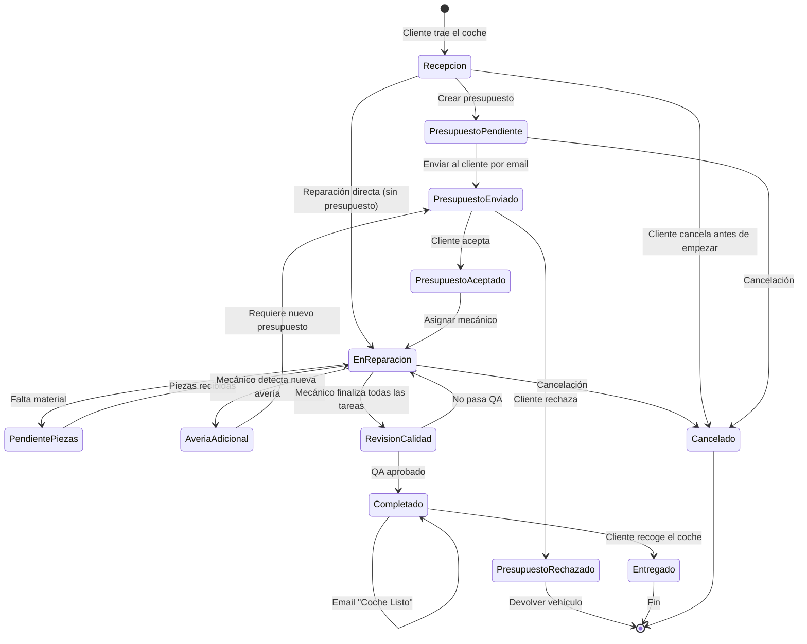
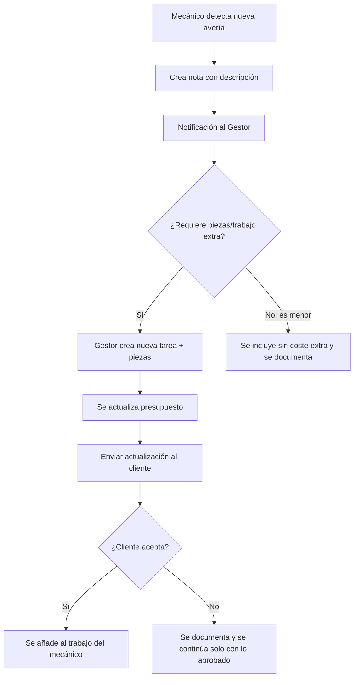

# 03 — Flujo de Trabajo y Ciclo de Vida

> **Decisiones aplicadas**: Este documento refleja DA-01 (facturas unificadas), DA-02 (tabla vehículos), DA-03 (roles), DA-06 (editabilidad). Ver [doc 08](./08-DECISIONES-ARQUITECTURA.md).

## 3.1 Diagrama de Estados de una Orden de Reparación



---

## 3.2 Flujo Completo Paso a Paso

### PASO 1: Recepción del Vehículo

**Quién**: Recepcionista / Gestor del taller  
**Dónde**: Pantalla `Taller → Nueva Orden`

1. Se selecciona o crea el **cliente** (reutiliza la tabla `clientes` existente)
2. Se busca el **vehículo por matrícula** (tabla `vehiculos` — DA-02):
   - Si existe → se autocompletan marca, modelo, VIN, color, combustible
   - Si no existe → se crea nuevo vehículo vinculado al cliente
3. Se registran los **km de entrada** (se guardan en la orden Y se actualiza `vehiculos.km_actual`)
4. Se describe el **motivo de entrada** ("Ruido al frenar", "Luz del motor encendida")
5. Se registran **observaciones de recepción** (daños preexistentes, objetos en el vehículo)
6. **Inspección Visual (DVI)**: Se toman fotos del estado actual del vehículo (opcional pero recomendado)
7. Se establece la **prioridad** (urgente / alta / normal / baja) — **editable en cualquier momento posterior** (DA-06)
8. Se genera automáticamente:
   - El **número de orden** correlativo ("OR-2026-0001")
   - El **resguardo de depósito** (PDF descargable/imprimible)
   - Un **email al cliente** confirmando la recepción del vehículo

**Resultado**: Orden en estado `recepcion`

---

### PASO 2: Presupuesto Previo (Legal — RD 1457/1986)

**Quién**: Gestor del taller  
**Dónde**: Pantalla `Taller → Orden → Presupuesto`

1. Se añaden las **tareas previstas** (desde catálogo o personalizadas):
   - Descripción del trabajo
   - Horas estimadas × tarifa hora
   - Total mano de obra por tarea
2. Se añaden las **piezas previstas**:
   - Del catálogo o entrada manual
   - Cantidad × precio unitario
   - Si es pieza usada/reconstruida → marcar consentimiento del cliente
3. El sistema calcula automáticamente:
   - Total Mano de Obra
   - Total Piezas
   - Base Imponible
   - IVA (21%)
   - **Total del Presupuesto**
4. Se genera el **documento de presupuesto** (PDF) con todos los datos legales
5. Se envía al cliente por email con botón de aceptar/rechazar
6. Validez automática: 12 días hábiles (RD 1457/1986)

**Resultado**: Orden en estado `presupuesto_enviado`

> **Nota Legal**: El cliente puede renunciar expresamente al presupuesto. En ese caso, se marca `renuncia_presupuesto = true` y se procede directamente a la reparación.

---

### PASO 3: Aprobación del Cliente

**Quién**: Cliente (por email) o Gestor (por teléfono)  
**Opciones**:
- ✅ **Aceptar**: Se registra la aceptación, fecha, y el nombre de quien aceptó. Se puede solicitar firma digital.
- ❌ **Rechazar**: Se marca como rechazado. El vehículo debe devolverse en las mismas condiciones.

**Resultado**: Orden en estado `presupuesto_aceptado` o `presupuesto_rechazado`

---

### PASO 4: Asignación al Mecánico

**Quién**: Gestor del taller  
**Dónde**: Pantalla `Taller → Orden → Asignar`

1. Se asigna un **mecánico** (o grupo) a cada tarea individualmente
2. Se establece una **fecha estimada de finalización**
3. El mecánico recibe la notificación en su **Panel del Mecánico**
4. Opcionalmente se **imprime la hoja de trabajo** (PDF) para que el mecánico la tenga en el puesto

**Resultado**: Orden en estado `en_reparacion`

---

### PASO 5: Reparación (Panel del Mecánico)

**Quién**: Mecánico  
**Dónde**: Panel del Mecánico (vista móvil/tablet optimizada)

El mecánico ve sus tareas asignadas como un **checklist interactivo**:

```
┌─────────────────────────────────────────────┐
│  🚗 OR-2026-0015 | BMW 320d | 1234-ABC     │
│  Motivo: Ruido al frenar + revisión ITV     │
│  Prioridad: 🔴 URGENTE                      │
├─────────────────────────────────────────────┤
│  ☑️ Inspección visual del sistema de frenos  │
│  ☑️ Sustituir pastillas delanteras           │
│  ☐ Sustituir discos delanteros               │
│  ☐ Purgar circuito de frenos                 │
│  ☐ Comprobar nivel líquido de frenos         │
│  ☐ Prueba de rodaje                          │
├─────────────────────────────────────────────┤
│  📝 Notas: "Disco izquierdo con desgaste    │
│  irregular, posible problema de mordaza"     │
│                                              │
│  [+ Añadir nota]  [📷 Foto]                 │
│                                              │
│  ⚠️ [Reportar avería adicional]              │
│                                              │
│  🟢 [TODAS COMPLETADAS → PASAR A QA]        │
└─────────────────────────────────────────────┘
```

**Acciones del mecánico**:
- ✅ Marcar tareas como completadas (con timestamp)
- 📝 Añadir notas sobre cada tarea
- 📷 Tomar fotos durante la reparación
- ⚠️ **Reportar avería adicional**: Esto dispara un workflow especial (ver 3.3)
- 🟢 Cuando todas las tareas están completadas → botón "Pasar a revisión de calidad"

---

### PASO 6: Detección de Avería Adicional (Workflow Especial)



---

### PASO 7: Revisión de Calidad

**Quién**: Gestor del taller o Jefe de taller  
**Dónde**: Pantalla `Taller → Orden → Revisión`

1. Se revisa que todas las tareas estén completadas
2. Se verifican las notas del mecánico
3. Se revisan las fotos (si existen)
4. Se actualiza el registro de horas reales vs estimadas
5. Si todo OK → estado `completado`
6. Si no → devolver a `en_reparacion` con notas

---

### PASO 8: Facturación

**Quién**: Gestor del taller  
**Dónde**: Pantalla `Taller → Orden → Facturar`

1. Se genera la **factura de taller** automáticamente desde la orden:
   - Se usa el **emisor del taller** (segundo NIF)
   - Se desglosan mano de obra y piezas por separado
   - Se aplica IVA 21%
   - Se incluye la garantía legal
2. La factura se puede:
   - 📧 Enviar por email al cliente
   - 📄 Descargar como PDF
   - 🖨️ Imprimir
3. Se registra el **método de pago**: efectivo, tarjeta, transferencia, bizum, mixto
4. Se puede hacer pago parcial o total

---

### PASO 9: Notificación "Coche Listo"

**Quién**: Gestor del taller (un clic)  
**Acción**: Botón **"🔔 Notificar al cliente — Coche listo"**

Se envía un email profesional al cliente con:
- Confirmación de que su vehículo está listo para recoger
- Resumen de los trabajos realizados
- Importe total (si la factura ya está emitida)
- Horario de recogida del taller
- Datos de contacto

---

### PASO 10: Entrega del Vehículo

**Quién**: Gestor del taller  
**Dónde**: Pantalla `Taller → Orden → Entregar`

1. Se registra la **fecha real de entrega**
2. Se verifican las **piezas sustituidas**: ¿se devuelven al cliente? (obligatorio ofrecer, RD 1457/1986)
3. Se confirma el **pago** (si no estaba pagado ya)
4. Se activa automáticamente la **garantía** (3 meses / 2.000 km)
5. Se toman fotos de entrega (opcional)
6. Estado → `entregado`

---

## 3.3 Vista del Panel del Mecánico (Kanban)

El mecánico accede a una vista simplificada tipo **Kanban** con 4 columnas:

```
┌─────────────┬──────────────┬───────────────┬──────────────┐
│   PENDIENTE  │  EN PROGRESO │ ESPERANDO     │  COMPLETADO  │
│              │              │  PIEZAS       │              │
├─────────────┼──────────────┼───────────────┼──────────────┤
│             │ 🚗 BMW 320d  │ 🚗 Peugeot    │ 🚗 Seat      │
│             │ 1234-ABC     │ 208 5678-XYZ  │ Ibiza        │
│             │ ■■■■□ 80%    │ ■■□□□ 40%     │ 9012-DEF     │
│             │ 🔴 Urgente   │ 🟡 Alta       │ ■■■■■ 100%   │
│             │              │               │ 🟢 Normal    │
│             │ [Ver tareas] │ [Ver tareas]  │ [→ QA]       │
└─────────────┴──────────────┴───────────────┴──────────────┘
```

### Características del Panel:
- **Responsive**: Funciona perfecto en móvil (el mecánico lo puede ver en su teléfono)
- **En tiempo real**: Se actualiza cuando el gestor añade tareas o piezas
- **Tap para expandir**: Toca una tarjeta para ver/marcar las tareas
- **Barra de progreso**: Indica % de tareas completadas visualmente
- **Colores de prioridad**: Rojo urgente, amarillo alta, azul normal, gris baja
- **Acceso rápido a notas y fotos**: Sin navegar a otra pantalla

---

## 3.4 Hoja de Trabajo Imprimible (PDF)

Para mecánicos que prefieran papel, se genera un PDF con:

```
╔══════════════════════════════════════════════════╗
║  FNAUTOS — HOJA DE TRABAJO                      ║
║  Orden: OR-2026-0015                             ║
╠══════════════════════════════════════════════════╣
║                                                  ║
║  VEHÍCULO                                        ║
║  Marca/Modelo: BMW 320d       Matrícula: 1234ABC ║
║  Color: Negro                 Km: 87.452         ║
║  VIN: WBAXXXXXXXXXXXXXXXXX                       ║
║                                                  ║
║  CLIENTE                                         ║
║  Nombre: Juan García López    Tel: 612 345 678   ║
║                                                  ║
║  MOTIVO DE ENTRADA                               ║
║  Ruido al frenar, revisión ITV                   ║
║                                                  ║
║  TAREAS                          COMPLETADO      ║
║  ┌──────────────────────────────┬───────────┐   ║
║  │ Inspección sistema frenos    │  ☐        │   ║
║  │ Sustituir pastillas delant.  │  ☐        │   ║
║  │ Sustituir discos delanteros  │  ☐        │   ║
║  │ Purgar circuito de frenos    │  ☐        │   ║
║  │ Comprobar nivel líquido      │  ☐        │   ║
║  │ Prueba de rodaje             │  ☐        │   ║
║  └──────────────────────────────┴───────────┘   ║
║                                                  ║
║  PIEZAS NECESARIAS                               ║
║  ┌──────────────────────────────────────────┐   ║
║  │ 1x Juego pastillas Brembo P 06 075      │   ║
║  │ 2x Disco freno Brembo 09.C401.13        │   ║
║  │ 1x Líquido frenos DOT4 1L               │   ║
║  └──────────────────────────────────────────┘   ║
║                                                  ║
║  NOTAS DEL MECÁNICO                              ║
║  ________________________________________        ║
║  ________________________________________        ║
║  ________________________________________        ║
║                                                  ║
║  Mecánico: ________________  Fecha: ___/___/___  ║
║  Firma: ___________________                      ║
╚══════════════════════════════════════════════════╝
```

---

## 3.5 Flujo de Cancelación de Orden

Una orden puede cancelarse en varios momentos del ciclo de vida. Las reglas son:

| Estado actual | ¿Se puede cancelar? | Consecuencias |
|---------------|:-------------------:|---------------|
| `recepcion` | ✅ Sí | Sin coste. Se devuelve el vehículo |
| `presupuesto_pendiente` | ✅ Sí | Sin coste. Se devuelve el vehículo |
| `presupuesto_enviado` | ✅ Sí | Sin coste. Se devuelve el vehículo |
| `presupuesto_aceptado` | ✅ Sí | Sin coste si no se ha empezado el trabajo |
| `en_reparacion` | ⚠️ Parcial | Se factura lo trabajado hasta el momento (mano de obra + piezas usadas) |
| `pendiente_piezas` | ⚠️ Parcial | Se factura lo trabajado. Las piezas pedidas y no usadas: según acuerdo |
| `revision_calidad` | ❌ No recomendado | La reparación está terminada, proceder a facturar |
| `completado` | ❌ No | Ya está facturado |
| `entregado` | ❌ No | Ya se entregó |

**Al cancelar una orden en reparación:**

1. Se registra el motivo de cancelación
2. Se calcula el coste parcial (horas reales trabajadas × tarifa + piezas instaladas)
3. Se genera una factura parcial por lo trabajado
4. Se registra en la timeline (`eventos_orden`)
5. Se notifica al cliente si la cancelación es por parte del taller
6. Estado → `cancelado`

---

## 3.6 Flujo de Reparación Directa (Sin Presupuesto)

En ciertos casos el cliente puede **renunciar expresamente al presupuesto** (Art. 14, RD 1457/1986):

### Cuándo aplica:
- Reparaciones menores donde el cliente ya conoce el coste aproximado
- Clientes habituales con relación de confianza
- Urgencias donde el cliente acepta verbalmente

### Flujo:

1. Se crea la orden de reparación normalmente
2. Se marca **"El cliente renuncia al presupuesto"** en la orden
3. El sistema registra `presupuestos_taller.renuncia_presupuesto = true`
4. **Se requiere firma del cliente** confirmando la renuncia (digital o en papel)
5. La orden pasa directamente de `recepcion` a `en_reparacion`
6. Al finalizar se factura normalmente

> ⚠️ **Importante legal**: La renuncia al presupuesto debe ser **fehaciente** y **documentada**. Sin firma = sin renuncia válida.

---

## 3.7 Vehículo No Recogido (Abandono)

Según la normativa, si un cliente no recoge su vehículo:

| Días sin recoger | Acción |
|-------------------|--------|
| **7 días** | Email de recordatorio automático |
| **15 días** | Segundo recordatorio + llamada telefónica |
| **30 días** | Notificación formal con coste de almacenamiento |
| **+2 meses** | Opciones legales según normativa autonómica |

El sistema debe:
- Detectar automáticamente órdenes en estado `completado` sin `fecha_entrega_real` durante más de 7 días
- Generar alertas internas al gestor
- Permitir registrar intentos de contacto en la timeline

---

## 3.8 Autenticación del Mecánico

Ver decisión completa en [08-DECISIONES-ARQUITECTURA.md — DA-03](./08-DECISIONES-ARQUITECTURA.md#da-03-roles-y-permisos-del-módulo-taller).

**Resumen**: Cada mecánico tiene su propio usuario de Supabase Auth con rol `mecanico`. Al acceder al ERP, solo ve la sección **Taller → Panel Mecánico** con sus tareas asignadas. No tiene acceso a facturación, configuración ni datos de otros mecánicos.

---

## 3.9 Editabilidad en el Flujo de Trabajo (DA-06)

> **Regla fundamental**: Todo lo que se crea, se puede modificar. El flujo nunca es rígido.

### Transiciones de estado reversibles

| Transición | ¿Reversible? | Nota al revertir |
|------------|:------------:|-----------------|
| Recepción → Presupuesto Pendiente | ✅ Sí | — |
| Presupuesto Pendiente → Enviado | ✅ Sí | Se marca como "no enviado" |
| Presupuesto Enviado → Aceptado | ✅ Sí | El cliente puede cambiar de opinión |
| Presupuesto Aceptado → En Reparación | ✅ Sí | Motivo obligatorio |
| En Reparación → Pendiente Piezas | ✅ Sí | Bidireccional |
| En Reparación → Revisión QA | ✅ Sí | Si no pasa QA, vuelve a reparación |
| Revisión QA → Completado | ⚠️ Solo adelante | Una vez completado, no se vuelve atrás |
| Completado → Entregado | ⚠️ Solo adelante | Cierre definitivo |
| Cualquiera → Cancelado | ⚠️ Solo adelante | Cancelación con motivo. No se puede reabrir |

### Qué se puede editar en cada estado

| Estado | Prioridad | Tareas | Piezas | Precio | Mecánico | Fotos |
|--------|:---------:|:------:|:------:|:------:|:--------:|:-----:|
| Recepción | ✅ | ✅ | ✅ | ✅ | ✅ | ✅ |
| Presupuesto (cualquier sub-estado) | ✅ | ✅ | ✅ | ✅ | ✅ | ✅ |
| En Reparación | ✅ | ✅ | ✅ | ⚠️ Con nota | ✅ | ✅ |
| Pendiente Piezas | ✅ | ✅ | ✅ | ⚠️ Con nota | ✅ | ✅ |
| Revisión QA | ✅ | ❌ | ❌ | ❌ | ❌ | ✅ |
| Completado | ❌ | ❌ | ❌ | ❌ | ❌ | ❌ |
| Entregado | ❌ | ❌ | ❌ | ❌ | ❌ | ❌ |
| Cancelado | ❌ | ❌ | ❌ | ❌ | ❌ | ❌ |

### Reordenación de prioridades

Cuando hay múltiples órdenes con la misma prioridad (ej: 3 urgentes), el gestor puede:

1. **Arrastrar y soltar** (drag & drop) para poner una orden por encima de otra
2. El campo `orden_prioridad` (INTEGER) se actualiza automáticamente al soltar
3. El orden se refleja en el panel del mecánico: las tareas de la orden con mayor prioridad aparecen primero
4. Si se cambia la prioridad de urgente a normal, la orden baja automáticamente en la lista

### Cambio de estado rápido

En lugar de ir al detalle de la orden para cambiar estado:

1. Desde la **lista de órdenes**: botón contextual "→ Pasar a [siguiente estado]"
2. Desde el **panel mecánico**: arrastrar tarjeta entre columnas Kanban
3. Desde el **detalle de orden**: botón de acción principal + botón secundario para retroceder

---

## 3.10 Optimización del Flujo

| Punto del flujo | Optimización |
|-----------------|-------------|
| **Búsqueda de vehículo** | Debounce 300ms + autocompletado desde `vehiculos`. Se precargan los últimos 5 vehículos del cliente |
| **Cálculo de totales** | Recálculo en tiempo real con `useMemo`. Sin esperar al servidor |
| **Guardar tareas/piezas** | Optimistic update + debounce 500ms para guardado automático |
| **Kanban del mecánico** | `@dnd-kit/core` con virtualización si hay >20 tarjetas |
| **Timeline de eventos** | Infinite scroll con cursor-based pagination |
| **Fotos del vehículo** | Compresión client-side antes de subir. Thumbnail en lista, full en lightbox |
| **Generación de PDF** | Server-side async. Si tarda >2s, mostrar skeleton y notificar cuando esté listo |
| **Envío de emails** | Background job. No bloquea la UI. Toast de confirmación cuando se envía |
