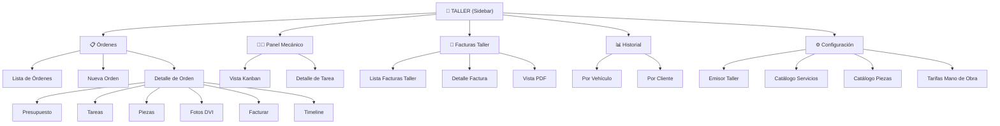

# 05 — Interfaz de Usuario y Páginas

## 5.1 Mapa de Navegación



---

## 5.2 Estructura de Rutas (Next.js App Router)

```
src/app/(dashboard)/taller/
├── page.tsx                          → Redirect a /taller/ordenes
├── ordenes/
│   ├── page.tsx                      → Lista de Órdenes (tabla/filtros)
│   ├── nueva/
│   │   └── page.tsx                  → Formulario Nueva Orden
│   └── [id]/
│       ├── page.tsx                  → Detalle de Orden (tabs)
│       ├── presupuesto/
│       │   └── page.tsx              → Presupuesto (generar/ver/enviar)
│       ├── facturar/
│       │   └── page.tsx              → Generar factura desde esta orden
│       └── pdf/
│           └── route.ts              → API: generar PDF resguardo/hoja trabajo
│
├── panel-mecanico/
│   └── page.tsx                      → Vista Kanban del mecánico
│
├── facturas/
│   ├── page.tsx                      → Lista de Facturas del Taller
│   └── [id]/
│       ├── page.tsx                  → Detalle de factura
│       ├── pdf/
│       │   └── route.ts             → API: generar PDF factura taller
│       └── email/
│           └── page.tsx             → Enviar factura por email
│
├── historial/
│   └── page.tsx                      → Historial de reparaciones
│
└── configuracion/
    ├── page.tsx                      → Configuración general del taller
    ├── servicios/
    │   ├── page.tsx                  → CRUD catálogo de servicios
    │   └── nuevo/
    │       └── page.tsx
    ├── piezas/
    │   ├── page.tsx                  → CRUD catálogo de piezas
    │   └── nuevo/
    │       └── page.tsx
    └── emisor/
        └── page.tsx                  → Configurar emisor fiscal del taller
```

---

## 5.3 Diseño de Pantallas Principales

### 5.3.1 Lista de Órdenes de Reparación

**Ruta**: `/taller/ordenes`

**Diseño**: Tabla con filtros y estadísticas rápidas (mismo estilo que la lista de facturas actual)

```
┌─────────────────────────────────────────────────────────────────┐
│  🔧 Órdenes de Reparación                    [+ Nueva Orden]   │
├─────────────────────────────────────────────────────────────────┤
│                                                                  │
│  Estadísticas rápidas (cards superiores):                       │
│  ┌──────────┐ ┌──────────┐ ┌──────────┐ ┌──────────┐          │
│  │ 12       │ │ 5        │ │ 3        │ │ 2        │          │
│  │ Total    │ │ En       │ │ Pendiente│ │ Listas   │          │
│  │ abiertas │ │ reparac. │ │ piezas   │ │ recoger  │          │
│  └──────────┘ └──────────┘ └──────────┘ └──────────┘          │
│                                                                  │
│  Filtros: [Estado ▾] [Prioridad ▾] [Mecánico ▾] [🔍 Buscar]   │
│                                                                  │
│  ┌─────────┬───────────┬───────────┬─────────┬────────┬──────┐ │
│  │ Orden   │ Vehículo  │ Cliente   │ Estado  │Prior.  │Fecha │ │
│  ├─────────┼───────────┼───────────┼─────────┼────────┼──────┤ │
│  │OR-0015  │BMW 320d   │J.García   │🔵 En rep│🔴 Urg │14/04 │ │
│  │         │1234-ABC   │           │         │        │      │ │
│  ├─────────┼───────────┼───────────┼─────────┼────────┼──────┤ │
│  │OR-0014  │Peugeot 208│M.López    │🟡 Pzas. │🟡 Alta│13/04 │ │
│  │         │5678-XYZ   │           │         │        │      │ │
│  ├─────────┼───────────┼───────────┼─────────┼────────┼──────┤ │
│  │OR-0013  │Seat Ibiza │A.Martín   │🟢 Lista │🔵 Norm│12/04 │ │
│  │         │9012-DEF   │           │         │        │      │ │
│  └─────────┴───────────┴───────────┴─────────┴────────┴──────┘ │
└─────────────────────────────────────────────────────────────────┘
```

### Funcionalidades:
- **Búsqueda** por matrícula, nombre de cliente, número de orden (debounce 300ms)
- **Filtros** combinables: estado, prioridad, mecánico asignado, rango de fechas
- **Acciones rápidas**: clic en fila → detalle de la orden
- **Badge de estado** con colores diferenciados
- **Indicador de progreso** (% tareas completadas)

### Editabilidad en la lista (DA-06):
- **Prioridad inline**: Click en el badge de prioridad → dropdown para cambiar (urgente/alta/normal/baja). Cambio instantáneo con optimistic update
- **Drag & drop para reordenar**: Dentro de la misma prioridad, arrastrar filas para cambiar el orden. Si hay 2 urgentes, se puede poner uno primero
- **Asa de arrastre**: Icono `≡` a la izquierda de cada fila para iniciar el drag
- **Feedback visual**: Al arrastrar, la fila se eleva con sombra. La posición de destino se indica con una línea azul
- **Guardado automático**: El campo `orden_prioridad` se actualiza al soltar. Sin botón "Guardar"
- **Estado rápido**: Botón de acción contextual en cada fila para avanzar/retroceder estado (ej: "Pasar a En Reparación")

---

### 5.3.2 Nueva Orden de Reparación

**Ruta**: `/taller/ordenes/nueva`

**Diseño**: Formulario multi-sección con wizard progresivo

```
┌─────────────────────────────────────────────────────────────┐
│  🔧 Nueva Orden de Reparación                               │
├─────────────────────────────────────────────────────────────┤
│                                                              │
│  ❶ CLIENTE ─────────────────────────────────────────        │
│  [🔍 Buscar cliente existente        ▾]  [+ Nuevo]          │
│  ┌───────────────────────────────────────────────┐          │
│  │ Juan García López | NIF: 12345678A            │          │
│  │ C/ Mayor 15, Madrid | Tel: 612 345 678        │          │
│  └───────────────────────────────────────────────┘          │
│                                                              │
│  ❷ VEHÍCULO ────────────────────────────────────────        │
│  Matrícula: [1234 ABC    ]  Marca:  [BMW        ▾]          │
│  Modelo:    [320d         ]  Año:    [2020       ]          │
│  Color:     [Negro        ]  VIN:    [WBA...     ]          │
│  Km:        [87.452       ]  Comb:   [Diesel    ▾]          │
│                                                              │
│  ❸ MOTIVO DE ENTRADA ──────────────────────────────          │
│  ┌───────────────────────────────────────────────┐          │
│  │ Ruido al frenar, el cliente indica que        │          │
│  │ chirría al pisar el freno...                  │          │
│  └───────────────────────────────────────────────┘          │
│                                                              │
│  ❹ OBSERVACIONES DE RECEPCIÓN ─────────────────────          │
│  ┌───────────────────────────────────────────────┐          │
│  │ Golpe leve en parachoques trasero (previo).   │          │
│  │ Sin objetos de valor en el interior.           │          │
│  └───────────────────────────────────────────────┘          │
│                                                              │
│  ❺ CONFIGURACIÓN ──────────────────────────────────          │
│  Prioridad:    [🔵 Normal    ▾]                              │
│  Fecha est.:   [📅 18/04/2026 ]                              │
│                                                              │
│  ❻ FOTOS DE RECEPCIÓN (DVI) ──────────────── Opcional       │
│  [📷 Añadir fotos] [📱 Desde cámara]                        │
│  ┌─────┐ ┌─────┐ ┌─────┐                                   │
│  │ 📷  │ │ 📷  │ │  +  │                                   │
│  │foto1│ │foto2│ │     │                                   │
│  └─────┘ └─────┘ └─────┘                                   │
│                                                              │
│  ──────────────────────────────────────────────────          │
│  [Cancelar]                   [🔧 Crear Orden + Resguardo]  │
└─────────────────────────────────────────────────────────────┘
```

### Al crear la orden:
1. Se genera automáticamente el número correlativo (OR-2026-XXXX)
2. Se genera el **resguardo de depósito** (PDF) listo para imprimir/enviar
3. Se envía email de confirmación al cliente (si tiene email)
4. Se redirige al detalle de la orden

---

### 5.3.3 Detalle de Orden de Reparación

**Ruta**: `/taller/ordenes/[id]`

**Diseño**: Página con tabs horizontales + barra de acciones + timeline lateral

```
┌──────────────────────────────────────────────────────────────────┐
│  ← Volver    OR-2026-0015    🔴 URGENTE    🔵 EN REPARACIÓN     │
├──────────────────────────────────────────────────────────────────┤
│                                                                   │
│  ┌─────────────────────────────────┬───────────────────────────┐ │
│  │ 🚗 BMW 320d | 1234-ABC         │  📊 Progreso: ■■■■□ 80%   │ │
│  │ Cliente: Juan García López     │  ⏱️ Entrada: 14/04/2026    │ │
│  │ Motivo: Ruido al frenar        │  📅 Est. entrega: 18/04    │ │
│  └─────────────────────────────────┴───────────────────────────┘ │
│                                                                   │
│  [Tareas] [Piezas] [Presupuesto] [Fotos] [Timeline] [Notas]     │
│  ═══════                                                         │
│                                                                   │
│  ┌──────────────────────────────────────────────────────────┐   │
│  │ TAREAS DE REPARACIÓN                   [+ Añadir tarea] │   │
│  ├──────────────────────────────────────────────────────────┤   │
│  │ ☑️ Inspección sistema de frenos       Mario R.   2h ✅   │   │
│  │ ☑️ Sustituir pastillas delanteras     Mario R.   1h ✅   │   │
│  │ ☑️ Sustituir discos delanteros        Mario R.   1.5h ✅ │   │
│  │ ☑️ Purgar circuito de frenos          Mario R.   0.5h ✅ │   │
│  │ ☐  Comprobar nivel líquido frenos     Mario R.   0.5h    │   │
│  │ ☐  Prueba de rodaje                   Mario R.   0.5h    │   │
│  ├──────────────────────────────────────────────────────────┤   │
│  │ Total mano de obra: 6h × 35€/h = 210,00 €               │   │
│  └──────────────────────────────────────────────────────────┘   │
│                                                                   │
│  ACCIONES ────────────────────────────────────────────────────    │
│  [📄 Presupuesto] [🧾 Facturar] [🔔 Notificar Listo]           │
│  [📄 Resguardo]   [🖨️ Hoja de trabajo] [✅ Entregar]           │
└──────────────────────────────────────────────────────────────────┘
```

---

### 5.3.4 Panel del Mecánico (Vista Kanban)

**Ruta**: `/taller/panel-mecanico`

**Diseño**: Vista Kanban responsive (4 columnas en desktop, scroll horizontal en móvil)

Esta es la pantalla donde el mecánico trabaja día a día. Debe ser:
- **Ultra-rápida** de cargar
- **Touch-friendly** para usar con guantes o manos sucias
- **Botones grandes** y áreas de toque amplias
- **Información mínima pero suficiente** — sin saturar

**Móvil**: Las columnas se muestran como tabs (Pendiente | En curso | Espera | Listo)

```
MÓVIL:
┌────────────────────────────┐
│ 👨‍🔧 Mi Panel          🔄   │
├────────────────────────────┤
│ [Pendiente][En curso][Listo]│
│ ════════════                │
│                             │
│ ┌─────────────────────────┐│
│ │ 🚗 BMW 320d             ││
│ │ 1234-ABC                ││
│ │ Frenos + ITV            ││
│ │ ■■■■□ 4/6 tareas       ││
│ │ 🔴 URGENTE              ││
│ │                          ││
│ │ [▼ Ver tareas]          ││
│ └─────────────────────────┘│
│                             │
│ ┌─────────────────────────┐│
│ │ ☑️ Inspección frenos     ││
│ │ ☑️ Pastillas             ││
│ │ ☑️ Discos                ││
│ │ ☑️ Purga                 ││
│ │ ☐ Líquido frenos        ││
│ │ ☐ Prueba rodaje         ││
│ │                          ││
│ │ [📝 Nota] [📷 Foto]    ││
│ │                          ││
│ │ [⚠️ Nueva avería]       ││
│ │                          ││
│ │ [🟢 COMPLETADO → QA]   ││
│ └─────────────────────────┘│
└────────────────────────────┘
```

---

### 5.3.5 Configuración del Taller

**Ruta**: `/taller/configuracion`

**Diseño**: Cards con secciones, mismo estilo que la configuración actual

```
┌──────────────────────────────────────────────────────────────┐
│  ⚙️ Configuración del Taller                                 │
├──────────────────────────────────────────────────────────────┤
│                                                               │
│  ┌──────────────────────────┐  ┌──────────────────────────┐  │
│  │ 🏢 EMISOR FISCAL TALLER  │  │ 🏢 EMISOR FISCAL COCHES  │  │
│  │                           │  │                           │  │
│  │ NIF: Y1234567X            │  │ NIF: X7654321Y            │  │
│  │ Nombre: Autónomo Taller   │  │ Nombre: Jimmy A. Benitez │  │
│  │ Dirección: C/ Taller...   │  │ Dirección: C/ Coches...  │  │
│  │                           │  │                           │  │
│  │ [✏️ Editar]               │  │ [✏️ Editar]               │  │
│  └──────────────────────────┘  └──────────────────────────┘  │
│                                                               │
│  ┌──────────────────────────┐  ┌──────────────────────────┐  │
│  │ 💰 TARIFAS MANO DE OBRA │  │ 📦 CATÁLOGO SERVICIOS    │  │
│  │                           │  │                           │  │
│  │ Tarifa estándar: 35€/h   │  │ 24 servicios activos     │  │
│  │ Tarifa urgente: 50€/h    │  │                           │  │
│  │                           │  │                           │  │
│  │ [✏️ Editar]               │  │ [📋 Gestionar]           │  │
│  └──────────────────────────┘  └──────────────────────────┘  │
│                                                               │
│  ┌──────────────────────────┐                                │
│  │ 🔩 CATÁLOGO PIEZAS       │                                │
│  │                           │                                │
│  │ 156 piezas en inventario │                                │
│  │ 3 alertas stock bajo     │                                │
│  │                           │                                │
│  │ [📋 Gestionar]           │                                │
│  └──────────────────────────┘                                │
└──────────────────────────────────────────────────────────────┘
```

---

## 5.4 Componentes Reutilizables Nuevos

| Componente | Descripción |
|------------|-------------|
| `OrdenCard` | Tarjeta resumen de una orden (usada en Kanban y listas) |
| `TareaChecklist` | Checklist interactivo de tareas con estado |
| `PiezaSelector` | Buscador de piezas del catálogo con autocompletado |
| `ServicioSelector` | Buscador de servicios del catálogo |
| `VehiculoForm` | Formulario de datos del vehículo (reutilizable) |
| `EstadoBadge` | Badge colorizado según el estado de la orden |
| `PrioridadBadge` | Badge de prioridad (urgente/alta/normal/baja) |
| `TimelineOrden` | Timeline vertical de eventos de la orden |
| `FotosDVI` | Galería de fotos con upload integrado a Supabase Storage |
| `PresupuestoViewer` | Vista del presupuesto con botón de envío |
| `BotonNotificarListo` | Botón con confirmación para notificar al cliente |
| `ProgressBar` | Barra de progreso de tareas completadas |
| `HojaTrabajoButton` | Genera e imprime/descarga la hoja de trabajo PDF |

---

## 5.5 Integración en el Sidebar/Navegación

Se añade una nueva sección "TALLER" en el sidebar del dashboard, por debajo de "VENTAS":

```
SIDEBAR
├── 📊 Dashboard
├── 💼 VENTAS
│   ├── Facturas
│   ├── Contratos
│   ├── Clientes
│   ├── Pagos
│   └── Informes
├── 🔧 TALLER                 ← NUEVO
│   ├── Órdenes de Reparación
│   ├── Panel Mecánico
│   ├── Facturas Taller
│   └── Historial
├── 🚗 FLOTA
│   └── Vehículos
├── 💰 GASTOS
├── 👥 RRHH
├── 🏦 TESORERÍA
├── 📦 OPERACIONES
├── 📈 INFORMES
├── 🤖 ASISTENTE
└── ⚙️ CONFIGURACIÓN
    ├── Empresa (Vehículos)
    ├── Empresa (Taller)       ← NUEVO
    ├── Series
    ├── Conceptos
    └── Usuarios
```

> **Nota**: El mecánico con rol `mecanico` solo ve en el sidebar: **Dashboard** (limitado) y **Taller → Panel Mecánico**. No ve el resto de módulos.

---

## 5.5 Interacciones Editables (DA-06)

Cada pantalla del módulo taller tiene interacciones específicas de editabilidad:

### Lista de Órdenes (`/taller/ordenes`)

| Interacción | Comportamiento |
|-------------|----------------|
| Click en badge de **prioridad** | Dropdown inline: urgente/alta/normal/baja. Cambio instantáneo |
| **Drag & drop** de filas | Reordena órdenes dentro de la misma prioridad |
| Click en badge de **estado** | Botón contextual para avanzar/retroceder estado |
| **Filtros** | Combinables en tiempo real, sin botón de aplicar |

### Detalle de Orden (`/taller/ordenes/[id]`)

| Interacción | Comportamiento |
|-------------|----------------|
| **Tab Tareas**: añadir tarea | Botón "+ Añadir" siempre visible. Búsqueda en catálogo o tarea manual |
| **Tab Tareas**: reordenar | Drag & drop vertical entre tareas |
| **Tab Tareas**: reasignar mecánico | Dropdown inline en cada tarea. Cambio instantáneo |
| **Tab Tareas**: editar horas/precio | Campos editables inline. Recálculo automático del total |
| **Tab Tareas**: completar/descompletar | Checkbox. Al descompletar, pedir motivo breve |
| **Tab Tareas**: eliminar | Solo si no está completada. Confirmación simple (no modal pesado) |
| **Tab Piezas**: añadir/quitar | Búsqueda en catálogo + añadir. Quitar antes de facturar |
| **Tab Piezas**: editar cantidad/precio | Inline. Recálculo instantáneo |
| **Prioridad** | Dropdown siempre visible en la cabecera de la orden |
| **Estado** | Botón de acción principal "Pasar a [siguiente estado]" |
| **Estado atrás** | Botón secundario "Devolver a [estado anterior]" con nota obligatoria |

### Panel Mecánico (`/taller/panel-mecanico`)

| Interacción | Comportamiento |
|-------------|----------------|
| **Drag entre columnas** | Arrastrar tarjeta de Pendiente → En Progreso → Completado |
| **Drag vertical** | Reordenar tarjetas dentro de la misma columna |
| **Tap/click en tarjeta** | Expandir con animación suave para ver detalles |
| **Checkbox de subtareas** | Marcar/desmarcar. Al desmarcar, motivo breve |
| **Botón "Reportar avería"** | Formulario rápido: descripción + foto opcional |
| **Tarjetas urgentes** | Borde rojo pulsante. Siempre arriba en cada columna |

### Presupuesto (`/taller/ordenes/[id]/presupuesto`)

| Interacción | Comportamiento |
|-------------|----------------|
| **Editar antes de enviar** | Totalmente libre: añadir/quitar líneas, cambiar precios |
| **Editar después de enviar** | Crea "versión 2" automáticamente. Reenvía al cliente |
| **Botón reenviar** | Visible con contador de envíos (ej: "Reenviar (2/3)") |

### Factura (`/taller/facturas/[id]`)

| Interacción | Comportamiento |
|-------------|----------------|
| **Editar en borrador** | Todo editable: líneas, precios, datos del receptor |
| **Emitida** | Solo se puede anular (factura rectificativa) |
| **Registrar pago** | Pago total o parcial. Pago parcial muestra saldo pendiente |

---

## 5.6 Principios de Diseño UI

| Principio | Aplicación |
|-----------|------------|
| **Consistencia** | Mismos componentes, colores y patrones que el resto del ERP |
| **Feedback inmediato** | Toast de confirmación al guardar. Animación de check |
| **Sin sorpresas** | Los estados se indican siempre con badges de colores |
| **Móvil primero** | Kanban optimizado para touch. Botones ≥48px área táctil |
| **Skeleton loading** | Esqueletos animados mientras cargan datos |
| **Transiciones** | `transition: 200ms ease` en TODAS las interacciones |
| **Dark mode** | Compatible con el sistema de temas del ERP |
| **Accesibilidad** | Fuentes ≥16px en móvil. Contraste WCAG AA mínimo |

