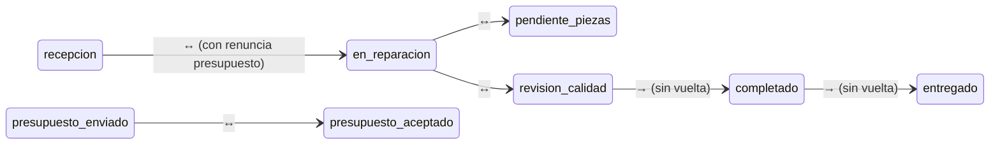

# 08 — Decisiones Arquitectónicas

> ✅ **Todas las decisiones están APROBADAS (DA-01 a DA-06).**  
> Este documento es la referencia técnica definitiva antes de iniciar el desarrollo.

---

## DA-01: Reutilizar tabla `facturas` existente ✅ APROBADO

### Decisión

Se reutiliza la tabla `facturas` existente añadiendo campos para diferenciar facturas de vehículos y de taller. **No se crea tabla `facturas_taller` separada.**

### Cambios en la base de datos

```sql
-- Nuevos campos en la tabla facturas existente
ALTER TABLE facturas ADD COLUMN tipo TEXT NOT NULL DEFAULT 'vehiculo' 
    CHECK (tipo IN ('vehiculo', 'taller'));
ALTER TABLE facturas ADD COLUMN orden_reparacion_id UUID REFERENCES ordenes_reparacion(id);

-- Campos específicos del taller (NULL para facturas de vehículos)
ALTER TABLE facturas ADD COLUMN vehiculo_matricula TEXT;
ALTER TABLE facturas ADD COLUMN vehiculo_marca TEXT;
ALTER TABLE facturas ADD COLUMN vehiculo_modelo TEXT;
ALTER TABLE facturas ADD COLUMN vehiculo_km_entrada INTEGER;
ALTER TABLE facturas ADD COLUMN vehiculo_km_salida INTEGER;
ALTER TABLE facturas ADD COLUMN garantia_meses INTEGER DEFAULT 3;
ALTER TABLE facturas ADD COLUMN garantia_km INTEGER DEFAULT 2000;
ALTER TABLE facturas ADD COLUMN garantia_texto TEXT;
```

### Impacto en el código existente

| Componente | Cambio necesario |
|-----------|-----------------|
| **Listado facturas ventas** | Añadir `WHERE tipo = 'vehiculo'` a las queries existentes |
| **Listado facturas taller** | Nueva ruta con `WHERE tipo = 'taller'` |
| **PDF de factura** | Renderizar plantilla diferente según `tipo` |
| **Pagos** | Sin cambios — misma FK a `facturas(id)` |
| **Anulaciones** | Sin cambios — misma lógica |
| **Emails** | Plantilla diferente según `tipo` |
| **Series** | Nueva serie "FT" vinculada al emisor de taller |
| **Informes** | Filtrar por `tipo` para separar ventas de taller |

### Ventaja clave
Se reutiliza el **80% del código existente**: generación de PDF, envío por email, registro de pagos, anulaciones, series de facturación e informes fiscales.

---

## DA-02: Tabla `vehiculos` centralizada ✅ APROBADO

### Decisión

Se crea una tabla `vehiculos` centralizada para evitar duplicar datos del vehículo en cada orden de reparación.

### Tabla

```sql
CREATE TABLE vehiculos (
    id                  UUID PRIMARY KEY DEFAULT gen_random_uuid(),
    empresa_id          UUID NOT NULL REFERENCES empresas(id) ON DELETE CASCADE,
    cliente_id          UUID NOT NULL REFERENCES clientes(id) ON DELETE CASCADE,

    matricula           TEXT NOT NULL,
    marca               TEXT NOT NULL,
    modelo              TEXT NOT NULL,
    anio                INTEGER,
    color               TEXT,
    bastidor            TEXT,                    -- VIN
    combustible         TEXT CHECK (combustible IN ('gasolina', 'diesel', 'electrico', 'hibrido', 'glp', 'otro')),
    km_actual           INTEGER,                 -- Se actualiza con cada orden

    -- Datos adicionales
    fecha_matriculacion DATE,
    potencia_cv         INTEGER,
    tipo_vehiculo       TEXT DEFAULT 'turismo' 
        CHECK (tipo_vehiculo IN ('turismo', 'furgoneta', 'motocicleta', 'camion', 'otro')),

    notas               TEXT,
    activo              BOOLEAN NOT NULL DEFAULT true,

    created_at          TIMESTAMPTZ NOT NULL DEFAULT now(),
    updated_at          TIMESTAMPTZ NOT NULL DEFAULT now(),

    UNIQUE(empresa_id, matricula)
);

CREATE INDEX idx_vehiculos_empresa ON vehiculos(empresa_id);
CREATE INDEX idx_vehiculos_cliente ON vehiculos(cliente_id);
CREATE INDEX idx_vehiculos_matricula ON vehiculos(matricula);
```

### Impacto en `ordenes_reparacion`

La tabla `ordenes_reparacion` pasa a referenciar `vehiculos(id)` en lugar de almacenar campos sueltos:

```sql
-- EN VEZ DE campos individuales (vehiculo_marca, vehiculo_modelo, etc.)
-- SE USA:
vehiculo_id         UUID NOT NULL REFERENCES vehiculos(id),
vehiculo_km_entrada INTEGER,                -- Snapshot de km al crear la orden
vehiculo_km_salida  INTEGER,                -- Km al entregar
```

### Beneficios directos

| Beneficio | Detalle |
|-----------|---------|
| **Sin duplicación** | Un BMW 320d 1234-ABC existe UNA vez, aunque venga 10 veces |
| **Buscador por matrícula** | `SELECT * FROM vehiculos WHERE matricula ILIKE '%1234%'` |
| **Historial por vehículo** | `SELECT * FROM ordenes_reparacion WHERE vehiculo_id = X ORDER BY fecha_recepcion DESC` |
| **Km siempre actualizado** | Al cerrar cada orden se actualiza `vehiculos.km_actual` |
| **Autocompletado** | Al escribir matrícula, se auto-rellenan marca, modelo, color, VIN |

---

## DA-03: Roles y permisos ✅ APROBADO

### Decisión

Se implementan tres roles con permisos granulares. Cada mecánico tiene usuario Supabase propio.

### Roles

| Rol | Acceso |
|-----|--------|
| **Admin** | Todo el ERP + taller + configuración |
| **Gestor Taller** | Órdenes, presupuestos, facturas, comunicación, catálogos. NO configuración de empresa |
| **Mecánico** | SOLO panel mecánico: sus tareas, fotos, notas, reportar averías. NO factura, NO presupuesta, NO notifica |

### Implementación

```sql
ALTER TABLE perfiles ADD COLUMN rol_taller TEXT 
    CHECK (rol_taller IN ('admin', 'gestor_taller', 'mecanico'));
```

- **Middleware Next.js**: Redirige al mecánico a `/taller/panel-mecanico` si intenta acceder a otras rutas
- **RLS**: El mecánico solo ve órdenes donde tiene tareas asignadas (`mecanico_id = auth.uid()`)
- **UI condicional**: Botones de facturar/notificar/presupuestar se ocultan para el rol mecánico
- **Sidebar filtrado**: El mecánico solo ve Dashboard (limitado) + Taller → Panel Mecánico

### Matriz de permisos completa

| Acción | Admin | Gestor | Mecánico |
|--------|:-----:|:------:|:--------:|
| Crear/editar orden | ✅ | ✅ | ❌ |
| Cancelar orden | ✅ | ✅ | ❌ |
| Crear/editar/enviar presupuesto | ✅ | ✅ | ❌ |
| Asignar mecánico a tareas | ✅ | ✅ | ❌ |
| Ver panel mecánico (sus tareas) | ✅ | ✅ | ✅ |
| Marcar tareas completadas | ✅ | ✅ | ✅ (solo suyas) |
| Añadir notas / tomar fotos | ✅ | ✅ | ✅ |
| Reportar avería adicional | ✅ | ✅ | ✅ |
| Cambiar prioridad de una orden | ✅ | ✅ | ❌ |
| Reordenar órdenes urgentes | ✅ | ✅ | ❌ |
| Generar/enviar factura | ✅ | ✅ | ❌ |
| Registrar pago | ✅ | ✅ | ❌ |
| Notificar "coche listo" | ✅ | ✅ | ❌ |
| Entregar vehículo | ✅ | ✅ | ❌ |
| Configurar emisor taller | ✅ | ❌ | ❌ |
| Gestionar catálogos | ✅ | ✅ | ❌ |
| Ver KPIs del taller | ✅ | ✅ | ❌ |

---

## DA-04: Generación de números correlativos ✅ APROBADO

### Decisión

Función SQL que calcula el siguiente número basándose en prefijo + año. Patrón consistente con el resto del ERP.

```sql
CREATE OR REPLACE FUNCTION generar_numero_orden(p_empresa_id UUID, p_prefijo TEXT DEFAULT 'OR')
RETURNS TEXT AS $$
DECLARE
    v_anio TEXT;
    v_siguiente INTEGER;
BEGIN
    v_anio := EXTRACT(YEAR FROM now())::TEXT;
    
    SELECT COALESCE(MAX(
        CAST(SPLIT_PART(numero_orden, '-', 3) AS INTEGER)
    ), 0) + 1
    INTO v_siguiente
    FROM ordenes_reparacion
    WHERE empresa_id = p_empresa_id
    AND numero_orden LIKE p_prefijo || '-' || v_anio || '-%';
    
    RETURN p_prefijo || '-' || v_anio || '-' || LPAD(v_siguiente::TEXT, 4, '0');
END;
$$ LANGUAGE plpgsql;
```

Se aplica el mismo patrón para presupuestos (`PT-2026-XXXX`).

---

## DA-05: Dashboard y KPIs del Taller — Dos opciones

### Opción A: KPIs integrados en el Dashboard existente

Añadir una **fila de cards del taller** debajo de las de ventas en el dashboard principal.

```
┌──────────────────────────────────────────────────────────┐
│  📊 Dashboard                                             │
├──────────────────────────────────────────────────────────┤
│  VENTAS (existente)                                       │
│  ┌──────────┐ ┌──────────┐ ┌──────────┐ ┌──────────┐   │
│  │ Facturas │ │ Cobrado  │ │ Pendiente│ │ Clientes │   │
│  │ del mes  │ │ del mes  │ │ cobrar   │ │ nuevos   │   │
│  └──────────┘ └──────────┘ └──────────┘ └──────────┘   │
│                                                           │
│  🔧 TALLER (nuevo)                                        │
│  ┌──────────┐ ┌──────────┐ ┌──────────┐ ┌──────────┐   │
│  │ 12       │ │ 5        │ │ 3.200 €  │ │ 85%      │   │
│  │ Órdenes  │ │ En       │ │ Factur.  │ │ Tasa     │   │
│  │ activas  │ │ reparac. │ │ mes      │ │ aceptac. │   │
│  └──────────┘ └──────────┘ └──────────┘ └──────────┘   │
└──────────────────────────────────────────────────────────┘
```

| Ventaja | Desventaja |
|---------|------------|
| Todo en un vistazo, sin navegar | Puede saturar el dashboard si hay muchos módulos |
| Coherente con el diseño actual | KPIs limitados a 4-6 cards |

### Opción B: Dashboard dedicado del taller ⭐ RECOMENDADA

Dashboard propio en `/taller` con métricas detalladas, gráficos y alertas en tiempo real.

```
┌──────────────────────────────────────────────────────────────┐
│  🔧 Dashboard del Taller                                      │
├──────────────────────────────────────────────────────────────┤
│  Cards principales                                            │
│  ┌──────────┐ ┌──────────┐ ┌──────────┐ ┌──────────┐       │
│  │ 12       │ │ 5        │ │ 2        │ │ 3        │       │
│  │ Órdenes  │ │ En       │ │ Esperando│ │ Listos   │       │
│  │ activas  │ │ reparac. │ │ piezas   │ │ recoger  │       │
│  └──────────┘ └──────────┘ └──────────┘ └──────────┘       │
│                                                               │
│  ┌─────────────────────────┐  ┌────────────────────────────┐ │
│  │ 📈 Facturación mensual  │  │ 👨‍🔧 Productividad/mecánico  │ │
│  │    (gráfico de barras)  │  │    Mario R. — 42h factur. │ │
│  │                          │  │    Pedro G. — 38h factur. │ │
│  │    Mar  Abr  May  Jun   │  │    Luis T.  — 35h factur. │ │
│  └─────────────────────────┘  └────────────────────────────┘ │
│                                                               │
│  ┌─────────────────────────┐  ┌────────────────────────────┐ │
│  │ ⚠️ ALERTAS               │  │ 📊 Métricas clave          │ │
│  │ • 2 coches sin recoger  │  │ Tiempo medio reparación:   │ │
│  │   hace +7 días          │  │   3.2 días                 │ │
│  │ • 1 presupuesto caduca  │  │ Tasa aceptación: 85%       │ │
│  │   mañana                │  │ Facturación mes: 8.450 €   │ │
│  │ • Stock bajo: pastillas │  │ Ticket medio: 420 €        │ │
│  └─────────────────────────┘  └────────────────────────────┘ │
└──────────────────────────────────────────────────────────────┘
```

| Ventaja | Desventaja |
|---------|------------|
| KPIs completos con gráficos y alertas | Una pantalla más que mantener |
| Alertas proactivas (coches sin recoger, presupuestos caducando, stock bajo) | Mayor esfuerzo de desarrollo |
| Panel de productividad por mecánico | — |
| El Dashboard principal NO se satura | — |

### Recomendación → ✅ APROBADO

**Ambas opciones combinadas**:
1. **4 cards resumen** en el dashboard principal (Opción A) como acceso rápido
2. **Dashboard dedicado** completo en `/taller` (Opción B) con métricas, gráficos y alertas

Lo mejor de ambos mundos: resumen rápido al abrir el ERP + detalle completo para gestión del taller.

| KPI | Cálculo |
|-----|---------|
| **Órdenes activas** | `COUNT WHERE estado NOT IN ('entregado', 'cancelado')` |
| **Tiempo medio de reparación** | `AVG(fecha_entrega_real - fecha_recepcion)` en días |
| **Facturación taller (mes)** | `SUM(total) WHERE tipo = 'taller' AND mes actual` |
| **Tasa de aceptación** | `COUNT aceptados / COUNT enviados × 100` |
| **Productividad/mecánico** | `SUM(horas_reales) GROUP BY mecanico_id` al mes |
| **Órdenes pendientes entrega** | `COUNT WHERE estado = 'completado'` (coches listos sin recoger) |
| **Ticket medio** | Importe medio por factura de taller |
| **Stock bajo** | Piezas donde `stock_actual < stock_minimo` |

> **✅ APROBADO** — Ambas opciones: cards resumen en dashboard principal + dashboard dedicado en `/taller`.

---

## DA-06: Principios de Editabilidad y Fluidez ✅ OBLIGATORIO

### Filosofía

> **Todo lo que se crea, se puede modificar.** Cada estado, prioridad, asignación y orden debe poder cambiarse de forma rápida, fluida y sin fricción. El sistema debe sentirse **vivo y reactivo**, nunca rígido.

### Reglas de editabilidad

#### Prioridad de órdenes
| Acción | Cómo funciona |
|--------|---------------|
| **Cambiar prioridad** | Dropdown inline en la lista de órdenes. Un clic → cambiar de urgente a normal o viceversa. Sin modal de confirmación innecesario |
| **Ordenar dentro de la misma prioridad** | Drag & drop para reordenar. Si hay 3 órdenes urgentes, se puede arrastrar una para ponerla primera |
| **Orden de prioridad persistente** | Campo `orden_prioridad INTEGER` en la tabla. Se guarda automáticamente al soltar |

```sql
-- Nuevo campo para orden manual dentro de cada prioridad
ALTER TABLE ordenes_reparacion ADD COLUMN orden_prioridad INTEGER NOT NULL DEFAULT 0;
```

#### Estados de la orden
| Acción | Cómo funciona |
|--------|---------------|
| **Cambiar estado hacia adelante** | Botón de acción principal visible. Ej: "Pasar a En Reparación" |
| **Cambiar estado hacia atrás** | Permitido en ciertos casos (ej: devolver de QA a En Reparación). Con nota obligatoria del motivo |
| **Cambiar prioridad en cualquier momento** | Siempre editable mientras la orden no esté entregada o cancelada |

Transiciones **siempre editables** (ida y vuelta):



#### Tareas de reparación
| Acción | Cómo funciona |
|--------|---------------|
| **Reordenar tareas** | Drag & drop dentro de la orden |
| **Reasignar mecánico** | Dropdown inline en cada tarea |
| **Cambiar estado de tarea** | Toggle check/uncheck. Si se desmarca, se pide nota del motivo |
| **Editar horas/precio** | Campos editables inline. Se recalcula el total en tiempo real |
| **Eliminar tarea** | Permitido si no está completada. Confirmación simple |
| **Añadir tarea en cualquier momento** | Botón "+ Añadir tarea" siempre visible mientras la orden esté activa |

#### Piezas
| Acción | Cómo funciona |
|--------|---------------|
| **Añadir/quitar piezas** | En cualquier momento antes de facturar |
| **Editar cantidad/precio** | Inline. Recálculo automático de totales |
| **Cambiar tipo de pieza** | Dropdown (nueva/reconstruida/usada). Si usada → pedir consentimiento |

#### Presupuesto
| Acción | Cómo funciona |
|--------|---------------|
| **Editar antes de enviar** | Totalmente libre |
| **Editar después de enviar** | Se crea una "versión 2" del presupuesto. Se reenvía al cliente |
| **Reenviar** | Botón visible con contador de envíos |

#### Panel del mecánico (Kanban)
| Acción | Cómo funciona |
|--------|---------------|
| **Mover tarjeta entre columnas** | Drag & drop entre Pendiente ↔ En Progreso ↔ Esperando ↔ Completado |
| **Reordenar tarjetas dentro de columna** | Drag & drop vertical. Las urgentes se destacan visualmente |
| **Expandir/colapsar tareas** | Tap en la tarjeta. Animación suave de expansión |
| **Marcar/desmarcar tarea** | Checkbox con animación. Desmarcar pide motivo breve |

### Principios de UX para fluidez

| Principio | Implementación |
|-----------|----------------|
| **Guardado automático** | Los cambios inline se guardan con debounce (500ms). Sin botón "Guardar" para campos simples |
| **Feedback inmediato** | Toast de confirmación breve. Animación de check al guardar |
| **Optimistic updates** | La UI se actualiza ANTES de que responda el servidor. Si falla, se revierte con aviso |
| **Sin modales innecesarios** | Los modales de confirmación solo para acciones destructivas (eliminar, cancelar, anular) |
| **Undo** | Para acciones reversibles, mostrar toast con botón "Deshacer" durante 5 segundos |
| **Drag & Drop nativo** | Usar `@dnd-kit/core` (ya compatible con React 19) para todas las interacciones de arrastrar |
| **Transiciones CSS** | Todas las animaciones con `transition: 200ms ease`. Sin saltos bruscos |
| **Skeleton loading** | Mientras carga, mostrar esqueletos animados, nunca pantalla en blanco |
| **Infinite scroll o paginación** | Para listas grandes (>50 items) usar scroll infinito con virtualización |

### Principios de código para rendimiento

| Principio | Implementación |
|-----------|----------------|
| **Code splitting** | Cada ruta de taller es un chunk independiente (`dynamic import`) |
| **Server Components por defecto** | Solo usar `'use client'` cuando sea estrictamente necesario (formularios, Kanban) |
| **React.memo** | En componentes que reciben props estables (OrdenCard, TareaChecklist) |
| **useMemo/useCallback** | Para cálculos costosos (totales, filtros) y callbacks en listas |
| **Debounce en búsquedas** | 300ms de debounce en el buscador de matrícula, cliente, piezas |
| **Virtualización de listas** | Si hay >50 órdenes, usar `react-virtual` para renderizar solo lo visible |
| **Prefetch de rutas** | `<Link prefetch>` en las rutas más frecuentes del taller |
| **Cache de Supabase** | Usar `revalidatePath` estratégico, no global. Cache por ruta |
| **Queries optimizadas** | Siempre `SELECT` con campos específicos — nunca `SELECT *` en producción |
| **Índices compound** | Para queries frecuentes como "órdenes activas de una empresa ordenadas por prioridad y fecha" |

```sql
-- Índice compound para la query más frecuente del taller
CREATE INDEX idx_ordenes_activas ON ordenes_reparacion(empresa_id, estado, prioridad, orden_prioridad, fecha_recepcion DESC)
    WHERE estado NOT IN ('entregado', 'cancelado');
```
